# Automated-train -- TODO: TRANSLATE AND REFACTOR MD

##  PROJEKTNI ZADATAK

Brze pruge. Uvek aktuelne. Ali i tri sata putovanja od Beograda do Budimpešte, može da bude zamorno i "neprijatno" za putnike koji nisu navikli na te brzine. Zbog toga im je potrebno obezbediti što veći komfor i sigurnost u što više automatizovanim vagonima.  

Za osnovu sistema automatizacije pametnog voza treba projektovati odgovarajući SoC, koji će se moći upotrebiti za realizaciju različitih delova sistema. Na raspolaganju je standardni 32biti procesor sa kvazisinhronom magistralom. Procesor može da vidi memorijski prostor u bajtovima (*LITTLE ENDIAN* format) i ima jedan prekidni maskirajući ulaz sa aktivnim nivoom za prihvatanje prekida. Prekidi su vektorskog tipa. Takođe ima ulaz i za NMI prekid.  

SoC treba da poseduje  

- prekidni kontroler za prihvatanje prekida od internih periferija; 
- *watch dog* tajmer; 
- RTC tajmer 
- 8 bitni AD konvertor; 
- 8 bitni DA konvertor; 
- odgovarajući broj 8bitnih paralelnih portova; 
- 2 pundupleks UART-a sa programabilnim brojem bita koji se prenose 

(7, 8 ili 9), 

- 16bitni *free running* brojač sa više input capture registra i više output compare registra; 
- periferije koje projektant nađe da su još neophodne. 

Tehnologija izrade SoCa je takva da je predviđeno da radi sa napajanjem Vdd=3.3V.  

1. Nacrtati detaljnu logičku šemu unutrašnjosti SoCa. 
1. Napisati korisničko uputstvo, sa programerskog stanovišta, za korišćenje periferija SoCa.  

Karte za voz su RFID kartice.  

Centralna  kontrola  voza,  CKV,  nalazi  se  u  lokomotivi.  Realizovana  je  putem opštenameneskog  računara  (ima  svoju  tastaturu  i  monitor)  koji  poseduje  više  standardnih UARTa. CKV je serijskom vezom povezana sa glavnim kontrolerom vagona GKV. Broj vagona je maksimalno  10.  Putem  nje  mogu  da  se  programiraju  kodovi  „važećih“  kartica,  minimalne  i maksimalne temperature u pojedinim vagonima, kupeima, način rada sa osvetljenjem, prozora, .... Na stanici, CKV ostvaruje vezu sa peronskom kontrolom i dobija informacije o  prodatim kartama, važenju tih karata (destinaciji) itd...  

Pored ulaznih vrata u svaki vagon, nalazi se skriveni RFID čitač koji poseduje 10 8bitnih memorijskih  lokacija.  Čitanjem  tih  memorijskih  lokacija  (putem  SPI  magistrale)  moguće  je ustanoviti i da li se blizu čitača nalazi RFID kartica i koji je njen kod. Kada se detektuje „važeća“ kartica treba da se otključaju ulazna vrata aktiviranjem jednog ulaza (O) elektromehaničke brave. „Istovremeno“ sa aktiviranjem brave treba upaliti zelenu led diodu koja se nalazi na samim ulaznim vratima, kao znak da je dozvoljen ulazak u prostoriju i na LED displeju prikazati koliko sekundi će vrata biti još otvorena. Ako se vrata ne otvore u roku od 10sekundi treba ponovo „zaključati“ vrata aktiviranjem drugog ulaza (Z). Pobuda (logička jedinica) ulaznih „digitalnih“ signala O i Z elektromehaničke brave je jednosmerni signal 400V, max 1A, minimalnog trajanja 100ms i maksimalnog trajanja 200ms. Provera da li su vrata otvorena radi se „reed switch“ senzorom. 

Na svakom vagonu nalazi se led displej sa 2+2 cifre na kojem se prikazuje informacija o rednom broju vagona i broju slobodnih mesta, i njime upravlja GKV. Broj mesta u vagonu je 40.  

Na svakom sedištu se nalazi kontroler sedišta KS. U svakom sedištu nalazi se skriveni RFID čitač koji poseduje 10 8bitnih memorijskih lokacija. Čitanjem tih memorijskih lokacija (putem SPI magistrale) moguće je ustanoviti i da li se blizu čitača nalazi RFID kartica i koji je njen kod. Kada se detektuje „važeća“ kartica treba upaliti žutu led diodu koja se nalazi iznad sedišta kao znak da je sedište zauzeto.  

Na svakom mestu za sedenje, nalazi se detektor da li putnik sedi ili ne. Digitalni izlaz aktivan sa nivoom. Ako putnik sedi treba ugasiti žutu i upaliti zelenu diodu iznad sedišta. Ako je putnik zauzeo sedište (prineo karticu blizu čitača – svetli žuta dioda), a ne sedne u roku do 5 minuta, smatra se da sedište nije zauzeto i gasi se žuta dioda. 

U svakom vagonu se nalazi:  

- detektor  dima;  digitalni  izlaz  aktivan  sa  nivoom,  na  nepoznatom  naponskom potencijalu sa nivoima +5V i 0V; 
- analogni senzor temperature;  
- unutrašnja jedinica klima uređaja koji može da greje i da hladi, sa promenljivom brzinom  strujanja  vazduha.  Ulazni  signali  su  2  digitalna,  beznaponska,  uključi- isključi, grejanje-hlađene, i 1 analogni za kontrolu brzine obrtanja ventilatora (DC motor); Ako nema nikog u vagonu klima uređaj treba isključiti..  
- analogni senzor osvetljaja; 
- kontrola svetala, uključi-isključi (3 nezavisne „sijalice“ 400V 1A); Svetlo je moguće kontrolisati preko tri prekidača.  
- kontrola da li je sijalica ispravna. 
- prikaz trenutne temperature i mogućnost zadavanja temperature. 

U slučaju detekcije dima u bilo kom vagonu potrebno je aktivirati sirene (400V, 0.1A) koje se nalaze u svakom vagonu, zaustaviti voz i otključati vrata svakog vagona.  

Za rasporede senzora, prekidača, aktuatora uzeti razumne pretpostavke. Ako nešto nije definisano projektnim zadatkom takođe uzeti razumne pretpostavke. Ovim elementima upravlja GKV.  

Na svakom sedištu se nalazi -panik taster, ako putnicima pozli od prevelike brzine. Panik taster kontroliše KS. O pritisku na panik taster obaveštava se CKV, sa informacijom iz kojeg vagona i sa kojeg sedišta.  

1. Nacrtati blok šemu sistema i povezivanja pojedinih delova.  
1. Nacrtati projekat hardvera pojedinih delova. 
1. Definisati formate i protokole rada za poruke koje se prenose po magistralama.  
1. Opisati programske poslove svakog pojedinačnog SoCa. 

Dodatni poeni  

1. Kako detektovati da li je putnik izašao na stanici na kojoj je trebao. Odnosno kako 

detektovati da neko nije kupio kartu Beograd - Novi sad, a vozi se do Budimpešte. (5 poena)  

2. Realizacija otvaranja i zatvaranja prozora. Kontrola da li su prozori otvoreni. Ako je 

otvoren neki prozor (ima ih 20) klima uređaj takođe treba isključiti. ( 5 poena) 

##  ARHITEKTURA MIKROKONTROLERA

U ovom delu biće opisana arhitektura mikrokontrolera koji projektujemo za osposobljavanje svih funkcionalnosti pametnog voza, orgraničavajući se zadatim specifikacijama u zadatku. 

Pretpostavićemo  da  je  na  raspolaganju  procesor  (CPU)  sa  *Von  Neumann*-ovom arhitekturom  čija  je  karakteristika  da  su  programski  kod  i  memorijski  podaci  smešteni  u jedinstven memorijski prostor, i njima se pristupa preko zajedničke magistrale.* 

Veza unutrašnjih periferija mikrokontrolera se može videti na slici 2.1 . Sve periferije su objašnjene u više detalja u narednim poglavljima.* 

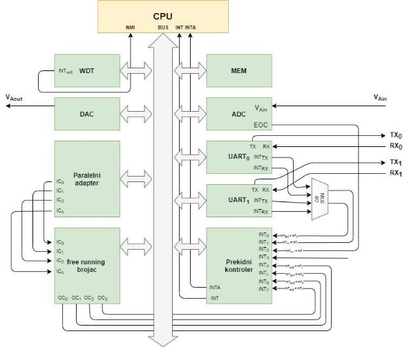

Slika 2.1 – *Unutrašnje periferije mikrokontrolera* 

### SISTEMSKA MAGISTRALA

Analizom zadatih funkcionalnosti pametnog voza zaključuje se da je potrebno koristiti 32- bitnu  zajedničku  magistralu  kako  bi  se  uspešno  ostvarila  komunikacija  i  kontrolisanje  svih periferija. Zajednička magistrala je po zadatom uslovu projekta kvazisinhrona. 

Za formiranje ove magistrale potrebna su 32 ulazno-izlazna signala za adrese ( 31..0) i podatke ( 31..0), 1 ulazni signal za signal potvrde od periferije ( ) i 3 izlazna signala koja služe za čitanje iz periferije ( ), upis u periferiju ( ) i za upravljanje bajtovima (32/8).  

U  slučaju  jednobajtnog  upisa  ili  čitanja,  memorijske  lokacije  koje ti  bajti  zauzimaju  su formata *LITTLE-ENDIAN*, što je prikazano na slici 2.1.1. U *little-endian* formatu niži bajt zauzima memorijsku lokaciju niže adrese. 

Slika 2.1.1 – *Izgled Little-endian format memorije* 

####  Dekoder adresa 

Svaka interna periferija mikrokontrolera zauzima neki deo memorijskog prostora i poseduje određeni broj registara neophodnih za ispravno funkcionisanje. Svakoj periferiji je neophodan dekoder adresa kako bi procesor mogao adresirati je. Izlaz iz takvog dekodera su signali  , 

−1

, … ,  , odnosno  ,  , … ,  , u zavisnosti da li čitamo ili upisujemo podatak u −2 0 −1 −2 0

periferiju.  Najniža  adresa  registra  u  periferiji  određuje  početnu  adresu  periferije,  odnosno adresni početak sukcesivnih memorijskih lokacija odgovarajuće periferije.  

Potrebno  je ostaviti  dovoljno  adresirajućih bita  da bi  procesor  mogao  komunicirati  sa internim periferijama, kojih ima 9. Da bi procesor mogao pravilno adresirati sve interne periferije ostvaljeno je 4 bita u 32bitnom adresnom prostoru koji će predstavljati adresu periferije. Ova 4 bita su gornja četiri bita 32bitne adrese. Samim tim svaka interna periferija ima dekoder adrese koji u sebi prvo proverava da li gornja 4 bita adrese odgovaraju zadatoj adresi periferije. U slučaju da  se  poklapaju  proveravaju  se  ostali  biti,  koji  predstavljaju  adresu  registara  ili  memorijske lokacije unutar odgovarajuće periferije. 

Slika 2.1.1.1 – *Prepoznavanje adrese periferije* 

### PREKIDNI KOTROLER

Prekidni  kontroler  je  uređaj  koji  kontroliše  prekidne  zahteve  internih  periferija mikrokontrolera i prosleđuje ih centralnoj procesorskoj jedinici (CPU).  

Prekidni kontroler u ovom mikrokontroleru realizovan je kao kotroler koji ima ukupno 8 ulaznih jedinica,  , ….,  (  je najmanjeg prioriteta). Procesor ima ulaz za  prekid, 

0 7 7

i smatra se da je hardverski već obezbeđeno da je većeg prioriteta nego prekid dobijen od maskirajućeg ulaza. Prekidni kontroler od 8 ulaznih maskirajućih prekida prosleđuje prekidni signal procesoru u slučaju da postoji bar jedan prekid, ali vodi računa koji je najvećeg prioriteta i koji prekidi su maskirani. Na slici 2.2.1 je prikazana veza između procesora, prekidnog kontrolera i  periferije.  Prekidni  kontroler  je programabilnog  tipa  i  zbog toga  je moguće  reprogramirati prekidni vektor preko njegovih kontrolnih registara. 

Slika 2.2.1 – *Način povezivanja prekidnog kontrolera* 

Pomoću kontrolnih registara unutar prekidnog kontrolera moguće je podesiti da li će biti aktivan  nivo  ili  ivica  prekidnog  signala,  ovo  je  obezbeđeno  na  memorijskoj  lokaciji  0.  Na memorijskoj lokaciji  kontroliše se maska. Ovo se postiže strukturom sa slike 2.2.2. 

1

Slika 2.2.2 – *Obrada prekidnog signala* 

Slika 2.2.3 – *Dobijanje signala INT* 

U trenutku ulaska u prekidnu rutinu svi prekidni zahtevi se lečuju, što se postiže na način prikazan na slici 2.2.4. Lečovanje se vrši signalom  . Maskiranjem je sprečeno otvaranje više trostatičkih bafera istovremeno, čime neće doći do sudara na magistrali. 

Slika 2.2.4 – *Pamćenje maskiranih prekida tokom prekidne rutine*  

Adresni prostor dodeljen prekidnom kontroleru 

Registrima dodeljenim prekidnom kontroleru se pristupa sa adresama sa  31..28  = 1000. Registri imaju inkrementirajuće adrese počevši od 80000000h 

- INT\_LVL\_REG , je registar koji određuje aktivan nivo prekida. Svaki bit u registru predstavlja aktivan nivo za određeni ulazni prekid. 

-Bit sa vrednošću “0” predstavlja da postoji zahtev za prekid na određenom prekidnom signalu -Bit sa vrednošću “1” predstavlja da ne postoji zahtev za prekid na određenom prekidnom signalu

|INT\_LVL\_REG|
| - |
|Bit |7 |6 |5 |4 |3 |2 |1 |0 |
|Naziv |ILR7 |ILR6 |ILR5 |ILR4 |ILR3 |ILR2 |ILR1 |ILR0 |
|Dozvola |W/R |W/R |W/R |W/R |W/R |W/R |W/R |W/R |
- INT\_MASK\_REG , je registar maski prekidnog kontrolera. Određeni bit odgovara maskirajućem bitu ulaznog prekidnog signala 

-Bit sa vrednošću “0” predstavlja da prekid nije maskiran 

-Bit sa vrednošću “1” predstavlja da je prekid maskiran

|INT\_MASK\_REG|
| - |
|Bit |7 |6 |5 |4 |3 |2 |1 |0 |
|Naziv |IMR7 |IMR6 |IMR5 |IMR4 |IMR3 |IMR2 |IMR1 |IMR0 |
|Dozvola |W/R |W/R |W/R |W/R |W/R |W/R |W/R |W/R |
- INT\_LVL\_EDGE\_REG , je registar koji kontroliše da li će se prekidni zahtev prihavtiti sa nivoom ili sa ivicom signala prekida. 

-Bit sa vrednošću “0” predstavlja prihvatanje nivoa prekidnog signala 

-Bit sa vrednošću “1” predstavlja prihvatanje ivice prekidnog signala

|INT\_LVL\_EDGE\_REG|
| - |
|Bit |7 |6 |5 |4 |3 |2 |1 |0 |
|Naziv |INTEL7 |INTEL6 |INTEL5 |INTEL4 |INTEL3 |INTEL2 |INTEL1 |INTEL0 |
|Dozvola |W/R |W/R |W/R |W/R |W/R |W/R |W/R |W/R |

### Watch dog tajmer 

Watch  dog  tajmer  je  supervizorska  komponenta  mikrokontrolera,  koja  obezbeđuje pravilno funkcionisanje. Njegova svrha je da vrši kontrolu pravilnog rada sistema. On povećava pouzdanost  pravilnog  izvršavanja  koda  mikrokontrolera,  koja  se  usled  promene  sadržaja memorije ili registara procesa unutar mikrokontrolera putem elektromagnetskih smetnji može narušiti.  

Naime, program mikrokontrolera mora biti napisan tako da sadrži sporadične instrukcije obraćanja *watch dog* tajmeru kao signal da sistem funkcioniše ispravno. Obaveza procesora je da se u određenim vremenskim trenucima obraća *watch dog* tajmeru čime signalizira pravilan rad. Ukoliko do ovog obraćanja ne dođe, ovo označava grešku u radu sistema i u tom trenutku mikrokontroler treba restartovati. Restartovanje mikrokontrolera u ovom slučaju vrši *watch dog* tajmer generisanjem signala RST. 

Watchdog  tajmer  se  može  ugasiti  ili  mu  se  promeniti  vrednost  odbrojavanja  putem upisivanja u njegove kontrolne registre. 

Slika 2.3.1 – *Watchdog tajmer* 

Adresni prostor dodeljen watchdog tajmeru 

Registrima dodeljenim watchdog tajmeru se pristupa sa adresama sa  31..28  = 0000. Registri imaju inkrementirajuće adrese počevši od 00000000h 

- WDT\_BYTE\_HIGH\_REG , je registar viših osam bitova podataka

|WDT\_BYTE\_HIGH\_REG|
| - |
|Bit |7 |6 |5 |4 |3 |2 |1 |0 |
|Naziv |WDT15 |WDT14 |WDT13 |WDT12 |WDT11 |WDT10 |WDT9 |WDT8 |
|Dozvola |W |W |W |W |W |W |W |W |
- WDT\_BYTE\_LOW\_REG , je registar nižih osam bitova podataka

|WDT\_BYTE\_LOW\_REG|
| - |
|Bit |7 |6 |5 |4 |3 |2 |1 |0 |
|Naziv |WDT7 |WDT6 |WDT5 |WDT4 |WDT3 |WDT2 |WDT1 |WDT0 |
|Dozvola |W |W |W |`  `W |W |W |W |W |

### RTC TAJMER (REAL TIME CLOCK) 

*Real time clock* (RTC) je elektronski uređaj koji meri protok vremena. Termin *Real time clock* koristi se da bi se izbegla zabuna sa uobičajenim hardverskim satovima koji su samo signali koji upravljaju digitalnom elektronikom i ne računaju vreme u ljudskim jedinicama. 

Primarna ideja je da imamo brojač koji će se stalno okretati a zaustaviti ga samo da nam ne smeta pri resetu. Računar će ga sam pokrenuti nakon završene inicijalizacije. Za tačno merenje vremena RTC poseduje  koji potiče od kvarcnog kristala učestanosti 32.768  . 

Adresni prostor dodeljen real time counter-u 

Registrima dodeljenim RTC se pristupa sa adresama sa  31..28  = 0001. Registri imaju inkrementirajuće adrese počevši od 10000000h 

- RTC\_CONFIG\_REG , je registar konfigurisanja RTC

|RTC\_CONFIG\_REG|
| - |
|Bit |7 |6 |5 |4 |3 |2 |1 |0 |
|Naziv |RTC7 |RTC6 |RTC5 |RTC4 |RTC3 |RTC2 |RTC1 |RTC0 |
|Dozvola |W |W |W |`  `W |W |W |W |W |

### FREE RUNNING BROJAČ SA IC I OC REGISTRIMA

U ovoj realizaciji, free-running brojač poseduje četiri input capture i četiri output compare registra. Free-running brojač je periferija koja je sinhronizovana sa sistemskim taktnim signalom i pored pomenutih registara je čini brojač koji neprestano broji u krug. Njegova realizacija je prikazana na slici 2.5.1. 

Pomoću output compare logike poredi se vrednost upisana u OC registar i vrednost do koje je brojač dostigao. Kada brojač dostigne upisane vrednosti, generiše se prekidni signal  frcntoc i koji poseduje svaka output compare logika. Osim ovog prekidnog signala, moguće je generisati i prekidni signal u trenutku kada brojač dostigne maksimalnu vrednost. Ovaj prekidni signal je označen sa  frcntmax.  

Input capture registri služe za merenje vremenskih intervala između dva eksterna događaja čitanjem sadržaja sa adresa.  

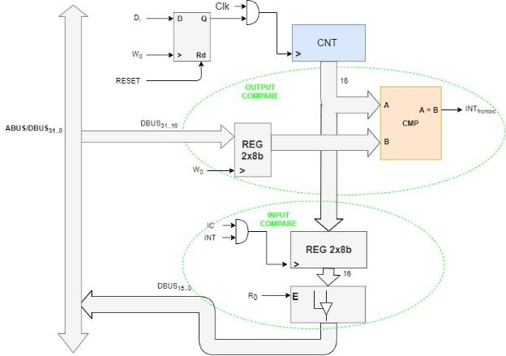

Slika 2.5.1 – *Freerunning brojač* 

Adresni prostor dodeljen freerunning brojču 

Registrima dodeljenim RTC se pristupa sa adresama sa  31..28  = 1100. Registri imaju inkrementirajuće adrese počevši od 01000000h 

- OC\_HIGH\_REGi , gde    = 0,1,2,3 ,je registar višeg bajta OC registra

|OC\_HIGH\_REGi|
| - |
|Bit |7 |6 |5 |4 |3 |2 |1 |0 |
|Naziv |OC15 |OC14 |OC13 |OC12 |OC11 |OC10 |OC9 |OC8 |
|Dozvola |W |W |W |`  `W |W |W |W |W |
- OC\_ LOW \_REGi , gde    = 0,1,2,3 ,je registar nižeg bajta OC registra

|OC\_LOW\_REGi|
| - |
|Bit |7 |6 |5 |4 |3 |2 |1 |0 |
|Naziv |OC7 |OC6 |OC5 |OC4 |OC3 |OC2 |OC1 |OC0 |
|Dozvola |W |W |W |`  `W |W |W |W |W |
- IC\_HIGH\_REGi , gde    = 0,1,2,3 ,je registar višeg bajta IC registra

|IC\_HIGH\_REGi|
| - |
|Bit |7 |6 |5 |4 |3 |2 |1 |0 |
|Naziv |IC15 |IC14 |IC13 |IC12 |IC11 |IC10 |IC9 |IC8 |
|Dozvola |W |W |W |`  `W |W |W |W |W |
- IC\_LOW\_REGi , gde    = 0,1,2,3 ,je registar nižeg bajta IC registra

|IC\_LOW\_REGi|
| - |
|Bit |7 |6 |5 |4 |3 |2 |1 |0 |
|Naziv |IC7 |IC6 |IC5 |IC4 |IC3 |IC2 |IC1 |IC0 |
|Dozvola |W |W |W |`  `W |W |W |W |W |

### AD KONVERTOR

AD konvertor nam je neophodan da bi mikrokontroler mogao da očitava stanje senzora koji kao izlaz daju analogni napon. Različite vrste AD konvertora se razlikuju po brzini, tačnosti, kompleksnosti, itd.*  

U ovom slučaju koristimo AD konvertor sa sukcesivnim aproksimacijama tačnosti od 8 bita, sa slike 2.6.1. Njegova prednost je u tome što nema *sample&hold* kolo ali zato ima čitav AD konvertor u sebi. Za funkcionisanje AD konvertora potrebni su konfiguracioni i statusni registri kao i izvor takta. Start konverzije i kraj konverzije  se zadaje u konfiguracionim registrima. Kada konvertor završi sa konverzijom neke vrednosti on signalizira procesoru prekidom i procesor čita vrednost koja se nalazi u izlaznom registru. Tačnost takođe zavisi i od referentnog napona pa je potrebno da bude što stabilniji.  

Slika 2.6.1 – *A/D konvertor* 

Da bi  dobili  validan podatak na  izlazu potrebno  je  da prođe  određeno  vreme.  To  je regulisano  (*End of Conversion*) signalom. Setovanjem signala  počinje konverzija, a signalom  se  završava.  Kod  signala  imamo  da  se  on  automatski  restartuje  po završetku konverzije.  signal je aktivan sa nivoom logičke jedinice i kao takav ostaje do naredne konverzije.  

Izmereni napon se računa preko formule:   = , gde je  vrednost broja 

28−1

koji se dobije nakon konverzije na magistrali. 

Adresni prostor dodeljen AD konvertoru 

Registrima dodeljenim ADC-u se pristupa sa adresama sa  31..28  = 0100. Registri imaju inkrementirajuće adrese počevši od 40000000h 

- ADC\_DATA\_REG , je registar u koji se upisuje vrednost konverzije i iščitava je procesor.

|ADC\_DATA\_REG|
| - |
|Bit |7 |6 |5 |4 |3 |2 |1 |0 |
|Naziv |ADC7 |ADC6 |ADC5 |ADC4 |ADC3 |ADC2 |ADC1 |ADC0 |
|Dozvola |R |R |R |R |R |R |R |R |
- ADC\_STATUS\_REG , je statusni registar, kojim se takođe kontroliše rad ADC. Biti koji se ne koriste hardkodovani su sa “0”.

|ADC\_STATUS\_REG|
| - |
|Bit |7 |6 |5 |4 |3 |2 |1 |0 |
|Naziv |/ |/ |/ |/ |/ |START|EOC|EN |
|Dozvola |R |R |R |R |R |W / R |R |W/ R |

*** DA KONVERTOR

DA konvertor nam je neophodan da bi mikrokontroler mogao da upravljao procesima koji rade  sa  analognim  veličinama.  Postoje  različiti  tipovi  DA  konvertora  koji  se  razlikuju  po performansu. Kod nas je potreban za kontrolisanje brzine ventilatora unutar klime uređaja. 

U ovom slučaju je upotrebljen kapacitivni DA konvertor koji radi sa tačnošću od 8 bita, sa 

slike 2.7.1.  

Slika 2.7.1 – *D/A konvertor* 

Tačnost konverzije zavisi od referentnog napona zato što je izlazni analogni napon neki umnožak referentnog napona. Prostu logiku sa slike 2.7.1 prate razni konfiguracioni i statusni registri. Konverzija se vrši tako što se digitalna vrednost upiše u prihvatni registar. Na izlazu će nakon konverzije biti odgovarajući izlazni napon koji će imati tu vrednost dok ne krene nova konverzija.

DA  konvertor  je  neophodno  da  povežemo  na  sistemsku  magistralu  kako  bi  mogao ispravno da funkcioniše. Postoji i ulaz za referentni napon. Bit DBUS8 (D8) sa magistrale podataka omogućeje rad celog modula.  

Adresni prostor dodeljen DA konvertoru 

Registrima dodeljenim DAC-u se pristupa sa adresama sa  31..28  = 0010. Registri imaju inkrementirajuće adrese počevši od 20000000h. 

- DAC\_DATA\_REG , je registar u koji se upisuje procesor vrednost za konvertovanje.

|DAC\_DATA\_REG|
| - |
|Bit |7 |6 |5 |4 |3 |2 |1 |0 |
|Naziv |DAC7 |DAC6 |DAC5 |DAC4 |DAC3 |DAC2 |DAC1 |DAC0 |
|Dozvola |W |W |W |`  `W |W |W |W |W |
- DAC\_STATUS\_REG , je statusni registar. Biti koji se ne koriste hardkodovani su sa “0”.

|DAC\_STATUS\_REG|
| - |
|Bit |7 |6 |5 |4 |3 |2 |1 |0 |
|Naziv |/ |/ |/ |/ |/ |/ |/ |EN |
|Dozvola |R |R |R |R |R |R |R |R |

### PARELERNI ADAPTER

Povezivanje mikrokontrolera sa drugim elektronskim uređajima je omogućeno pomoću paralernih  portova.  U  spoljašnosti  mikrokontrolera  postoji  24  pina  na  koje  su  povezane hardverske realizacije. Svi portovi su projektovani kao bidirekcioni i mogu se konfigurisati kao ulazni ili izlazni. Programeru je omogućeno da bira da li će biti ulazni ili izlazni pin, jer imamo prostorno i vremensko baferisanje sistemske magistrale koja ide van SoC-a (µC-a). Programeru je takođe dozvoljeno da menja svojstva pina tokom rada. Spajanje ulaznog i izlaznog pina u jedan jedinstveni,  uz  dodatak  jednog  konfiguracionog  registra  je  još  jedna  prednost  biderkcionih portova. Mikrokontrler sadrži 4 osmobitna paralerna porta. Konfiguracija jedanog bita može se videti na slici 2.8.1.  

Inicijalno stanje porta je ulazno i bira se *pull up* ili *pull down* otpornik prema neaktivnom stanju linije. Pomću trostatičkog bafera koji kontroliše konfiguracioni signal  čita se signal sa 

0

ulaznog bafera, dok pomoću  flipflopova se vrši upis signala na izlazni port. U našem slučaju izabran je *pull down.* 

Slika 2.8.1 – *Konfiguracija jednog bita/pina u 8bitnom paralelnom portu* 

Osam konfiguracija sa slike čine 8bitni paralelni port. Paralelni adapter u ovoj arhitekturi čine četiri 8bitna paralelna porta, i njegova veza u SoC-u se može videti na slici 2.8.2. 

Slika 2.8.2 – *Veza paralelnog adaptera u SoC-u* 

Adresni prostor dodeljen praralelnom adapteru 

Registrima dodeljenim paralelnom adapteru se pristupa sa adresama sa  31..28  = 0110. Registri imaju inkrementirajuće adrese počevši od 60000000h. 

- PP\_DATA\_REGi , gde    = 0,1,2,3 ,je registar paralelnog porta 

|PP\_DATA\_REGi|
| - |
|Bit |7 |6 |5 |4 |3 |2 |1 |0 |
|Naziv |PP7 |PP6 |PP5 |PP4 |PP3 |PP2 |PP1 |PP0 |
|Dozvola |W/R |W/R |W/R |W/R |W/R |W/R |W/R |W/R |
- DAC\_DATA\_REG , je registar kojim se konfiguriše režim rada paralelnog porta.  -Bit sa vrednošću “0” podešava paralelni port da radi kao ulazni 

-Bit sa vrednošću “1” podešava paralelni port da radi kao izlazni

|PP\_CONF\_REGi,|
| - |
|Bit |7 |6 |5 |4 |3 |2 |1 |0 |
|Naziv |PPDIR7 |PPDIR6 |PPDIR5 |PPDIR4 |PPDIR3 |PPDIR2 |PPDIR1 |PPDIR0 |
|Dozvola |W/R |W/R |W/R |W/R |W/R |W/R |W/R |W/R |

### UART 

**UART** (*Universal Asynhronous Receiver Transmiter*) je interna procesorska jedinica koja omogućava asinhronu komunikaciju sistema na čipu sa udaljenim periferijama. Format podataka i brzina prenosa su konfigurabilni.  

Hardver se sastoji od prijemne (**Rx**) i predajne strane (**Tx**). Poruka se sastoji od ***START*** bita (vrednost 0), poruke koja ima konfigurabilni broj bita (7, 8 ili 9) i ***STOP*** bita. Brzina prenosa se prilagođava na neki faktor od sistemskog takta. Kada se završi prenos, postoje dve opcije ili se pokreće prekid  ili se proverom bita ***STATUS*** ustanovljava da li je prenos u toku. Bit parnosti omogućava pouzdaniji prenos. Neusklađivanje brzina slanja na prijemnoj i predajnoj strani može dovesti  do  neregularnog  prijema  poruke.  Preko  postavljanja  određene  brzine  prenosa,  na prijemnoj strani je poznata brzina prenosa ali ne i početak odgovarajućeg bita. Zbog toga je na prijemnoj strani potrebno izvršiti sinhronizaciju prijema sa opadajućom ivicom koju generiše start bit.  Pored  toga,  oscilatori  koji  se  koriste  za  generisanje  sistemskog  takta  poseduju  „*drift*“, odnosno njihov izlaz odstupa od nominalne učestanosti, tako da iako je na prijemnoj strani izvršena  sinhronizacija  prema  početku  poruke,  u  toku  transmisije  može  doći  do  problema sinhronizacije.  

Slika 2.9.1 – *Deo uarta zadužen za slanje poruka (TX)* 

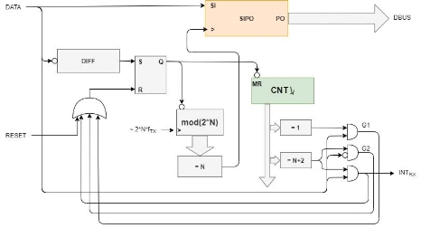

Slika 2.9.2 – *Deo uarta zadužen za prijem poruka (RX)* 

U projektu je zadato da SoC treba da ima dva UART adaptera sa programabilnim brojem prenosnih bita. Poruke za prenos se sastoje iz 7, 8 i 9 bita. Magistrala je pundupleks. Linija za prenos podataka ima vrednost logičke jedinice u neaktivnom stanju. Poruke su u formatu: 1 - start bit, 7/8/9-bit podatak, 0 - stop bit. Podatak koji se šalje može biti opciono 7, 8 ili 9 bitni. Ova opcija se bira konfigurisanjem kontrolnog registra UART-a.  

Adresni prostor dodeljen praralelnom adapteru 

Registrima dodeljenim paralelnom adapteru se pristupa sa adresama sa  31..28  = 0110. Registri imaju inkrementirajuće adrese počevši od 60000000h. 

- UART\_BYTE\_LOW\_REG , je registar nižeg bajta koji se čita/upisuje

|UART\_BYTE\_LOW\_REG|
| - |
|Bit |7 |6 |5 |4 |3 |2 |1 |0 |
|Naziv |UART7 |UART6 |UART5 |UART4 |UART3 |UART2 |UART1 |UART0 |
|Dozvola |W/R |W/R |W/R |W/R |W/R |W/R |W/R |W/R |
- UART\_BYTE\_HIGH\_REG , je registar višeg bajta koji se čita/upisuje

|UART\_BYTE\_HIGH\_REG|
| - |
|Bit |7 |6 |5 |4 |3 |2 |1 |0 |
|Naziv |/ |/ |/ |/ |/ |/ |/ |UART8 |
|Dozvola |R |R |R |R |R |R |R |W/R |
- UART\_CONF\_STAT\_REG , je registar za konfigurisanje uart adaptera. Biti LEN1 i LEN služe za biranje dužine poruke (0,1,2 −> 9,8,7). Setovanjem bita SND započinje slanje iz registara podataka. Bit blokira upis u registre padataka i resetuje se nakon izvršenog slanja. RCV bit je za prijem podatka. UARTSEL kontroliše koji je uart adapter aktivan trenutno.

|UART\_CONF\_STAT\_REG|
| - |
|Bit |7 |6 |5 |4 |3 |2 |1 |0 |
|Naziv |/ |/ |/ |UARTSEL |RCV |SND |LEN1 |LEN |
|Dozvola |R |R |R |W/R |W/R |W/R |W/R |W/R |

### SPI 

**SPI** (*Serial Peripheral Interface*) je jednostavni sinhroni *point-to-point* interfejs baziran na master-slave  principu.  On  obezbeđuje  punu-dupleks  komunikaciju  između  *master*-a  (našeg kontrolera) i jednog ili više *slave*-ova (periferijski uređaj). Interfejs se sastoji od 4 *single-ended* linije: 

MOSI (*Master Out, Slave In*): Linija se koristi od strane master-a za slanje podataka slave-u MISO (*Master In, Slave Out*): Linija se koristi za slanje podataka od *slave*-a ka *masteru*-u 

SCK (*System Clock*): Linija se koristi od Strane *master*-a za prenos signala takta 

SS (*Slave Select*): Linija se koristi od strane *master*-a za selekciju *slave*-a 

U  slučaju  našeg  kontrolera  SPI  komunikaciju  realizujemo  emulacijom.  Koristi  se  4  pina paralelnog  porta  za  emuliranje  SPI  komunikacije,  koristeći  pretpostavku  da  je   softverski ostavljeno dovoljno vremena za setup i hold vreme koje je potrebno periferijskom uređaju. 

Slika 2.10.1 – *Primer emuliranja SPI komunikacije pomoću paralelnog porta* 

### MEMORIJA

Sve periferije su memorijski mapirane i adrese njihovih registara se nalaze na dnu adresnog prostora. 

Slika 2.11.1 – *Memorijski prostor* 

##  AUTOMATIZACIJA VAGONA U VOZU

### ORGANIZACIJA SISTEMA

Automatizacija vagona je postignuta projektovanjem sistema koji se sastoji od *centralne kontrole voza* ( ), koja je opštenamenski račuanar unutar lokomotive, i više *glavnih kontrolera vagona* ( ), mikrokontrolera unutar svakog vagona. Ova organizacija se može videti na slici 3.1.1. 

*Centralna  kontrola  voza*  ( )  je  opštenamenski  računar  sa  povezanim  monitorom  i tastaturom.  CKV  služi  za  upravljanje  i  praćenje  trenutnog  stanja  svakog  vagona  od  strane mašinovođe iz lokomotive. CKV je povezan serijskom vezom pomoću UART-a sa svim GKV-ovima, i ima ulogu mastera u ovom sistemu. Ona zadaje komande GKV-u u kakvom stanju želi da vagon bude. Takođe prati da li postoji poruka od strane GKV-a, da li se desilo nešto unutar vagona poput pritisnutog panik tastera ili detekcije dima. 

*Glavni kontroler vagona* ( ) je projektovani mikrokontroler smešten unutar vagona, koji je serijskom vezom povezan sa CKV i ostalim GKV-ovima. Broj GKV-ova je jednak broju vagona (projektovano je najviše 10). GKV služi da kontroliše i prati trenutno stanje vagona u kojem se nalazi, i prihvata promene stanja koje CKV mu zada. GKV je povezan sa raznim periferijama i kontrolerima unutar vagona. 

*Kontrola sedišta* (**KS**) je projektovani mikrokontroler smešten unutar svakog sedišta, koji je serijskom vezom povezan sa GKV u kojem se nalazi. Broj KS je jednak broju sedišta unutar vagona (projektovano je najviše 40). KS kontroliše i prati trenutno stanje putnika. Da li je prisutan kod sedišta, da li je pritisnuo jedno od tastera kod sedišta (panik taster, taster za dotok klime ili za noćno svetlo. 

*Kontrola  prozora*  (**KP**)  je  projektovani  mikrokontroler  smešten  unutar  vagona,  koji  je serijskom vezom povezan sa GKV-om vagona u kom se nalazi i ostalim KP-ovima i jednim KO-om. U ovoj serijskoj vezi jedino komunicira sa GKV-om, tako što prima komande i vrednosti, a šalje jedino obaveštenja.  Kako  je  na  magistrali  zauzeto 40  adresa za  KS-ove,  ako  se doda  još  20 kontrolera neće biti potrebno proširivati adresni prostor. Ovim se može zaključiti da je moguće isprojektovati kontrolu prozora tako da svaki prozor ima sopstveni mikrokontroler, što ćemo i uraditi. 

*Kontrola osvetljenja* (**KO**) je projektovani mikrokontroler smešten unutar vagona, koji je serijskom vezom povezan sa GKV-om vagona u kom se nalazi i KP-ovima. U ovoj serijskoj vezi jedino komunicira sa GKV-om, tako što prima komande i vrednosti, a šalje jedino obaveštenja. Kako je na magistrali do sada zauzeto 60 adresa, moguće je zauzeti još četiri. Kontroli osvetljenja je dovoljna samo jedna za jedan mikrokontroler, da bi kontrolisala glavno svetlo u vagonu. 

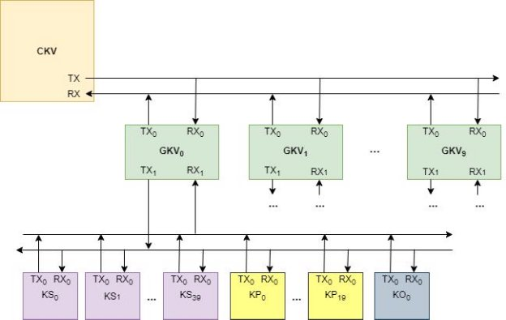

Slika 3.1.1 – *Blok šema glavnih komponenti za automatizaciju* 

#### Format i protokol rada 

Protokol komunikacije ovih kontrolera preko UART-a biće detaljno objašnjen za svaki smer komunikacije  između  njih.  Protokoli  prate  standard  sa  sitnim  dodacima  kojim  se  ova  UART magistrala koristi i za zadavanje željenog stanja i za slanje informacije o trenutnom stanju u kom se nalazi kontroler i njegov sistem kojem je dodeljen. 

**CKV komunicira sa GKV-ovima** preko serijske UART magistrale. Prenos informacija je 9- bitni, što odgovara konfiguraciji uarta GKV-a po resetu. Prenos informacija podrazumeva prenos adrese, podataka, obaveštenja ili instrukcije. 

- Prenos adresa, se prepoznaje pomću hardkodovane “0” na najviša dva bita prenesene informacije. Setovan bit4 ALL je broadcast adresa svakog GKV-a. Pošto je projektovan maksimalan broj vagona 10, ostavljaju se 4 bita za adresu GKV-a 

|CKV – GKV magistrala, prenos adresa|
| - |
|Bit |8 |7 |6 |5 |4 |3 |2 |1 |0 |
|Naziv |“0” |“0” |/ |/ |ALL |A3 |A2 |A1 |A0 |
- Prenos  instrukcija,  se  prepoznaje  pomoću  hardkovanjem  najviša  dva  bita  sa  “01”  prenesene informacije. Istrukcija je moguće imati 128, one koje su implementirane definisane kasnije. 

|CKV – GKV magistrala, prenos instrukcija|
| - |
|Bit |8 |7 |6 |5 |4 |3 |2 |1 |0 |
|Naziv |“0” |“1” |I6 |I5 |I4 |I3 |I2 |I1 |I0 |
- Prenos podataka, se prepoznaje pomoću harkodovane “1” na najvišem bitu. Ovim je moguće imati 8bitni prenos podataka u jednom ciklusu. 

|CKV – GKV magistrala, prenos podataka|
| - |
|Bit |8 |7 |6 |5 |4 |3 |2 |1 |0 |
|Naziv |“1” |D7 |D6 |D5 |D4 |D3 |D2 |D1 |D0 |
**GKV komunicira sa CKV** preko serijske UART magistrale. Prenos informacija je 9-bitni, što odgovara konfiguraciji uarta GKV-a po resetu. Prenos informacija podrazumeva slanje adrese GKV-a i informacije o stanju vagona. 

- Prenos obaveštenja, se prepoznaje pomoću harkodovanim “1” na najvišim bitovima. Ovim se šalje obaveštenje o problemima iz vagona. Šalje se i adresa iz kog vagona potiče problem. Detekcija dima, pritiska panik tastera i prisustvo putnika koji bi trebao da siđe. 

|GKV – CKV magistrala, prenos obaveštenja|
| - |
|Bit |8 |7 |6 |5 |4 |3 |2 |1 |0 |
|Naziv |“0” |ABOARD |PANIC |SMOKE |ALL |A3 |A2 |A1 |A0 |
- Prenos podataka, se prepoznaje pomoću harkodovane “1” na najvišem bitu. Ovim je moguće imati 8bitni prenos podataka u jednom ciklusu. 

|GKV – CKV magistrala, prenos podataka|
| - |
|Bit |8 |7 |6 |5 |4 |3 |2 |1 |0 |
|Naziv |“1” |D7 |D6 |D5 |D4 |D3 |D2 |D1 |D0 |
**GKV komunicira sa KS, KP i KO** preko serijske UART magistrale. Prenos informacija je 9- bitni,  što  odgovara  konfiguraciji  uarta  mikrokontrolera  po  resetu.  Prenos  informacija podrazumeva prenos adrese, podataka ili instrukcije. 

- Prenos adresa, se prepoznaje pomću hardkodovane “0” na najviša dva bita prenesene informacije. Setovan bit6 ALL je broadcast adresa svakog mikrokontrolera. Pošto je projektovan maksimalan broj sedišta 40, prvih 40 adresa je za KS, narednih 20 je za KP, a jedna je za KO. Na slanje instrukcije broadcast adresi, jedino će kontroleri kojima je namenjena instrukcija je prepoznati, ostali neće reagovati na nju. 

|GKV – KS-KP-KO magistrala, prenos adresa|
| - |
|Bit |8 |7 |6 |5 |4 |3 |2 |1 |0 |
|Naziv |“0” |“0” |ALL |A5 |A4 |A3 |A2 |A1 |A0 |
- Prenos  instrukcija,  se  prepoznaje  pomoću  hardkovanjem  najviša  dva  bita  sa  “01”  prenesene informacije. Istrukcija je moguće imati 128, one koje su implementirane definisane kasnije. 

|GKV – KS-KP-KO magistrala, prenos instrukcija|
| - |
|Bit |8 |7 |6 |5 |4 |3 |2 |1 |0 |
|Naziv |“0” |“1” |I6 |I5 |I4 |I3 |I2 |I1 |I0 |
- Prenos podatka, se prepoznaje pomoću harkodovanim “0” na najvišem bitu. Ovim se šalju podaci  

|GKV – KS-KP-KO magistrala, prenos podataka|
| - |
|Bit |8 |7 |6 |5 |4 |3 |2 |1 |0 |
|Naziv |“1” |D7 |D6 |D5 |D4 |D3 |D2 |D1 |D0 |
**KS komunicira sa GKV** preko serijske UART magistrale. Prenos informacija je 9-bitni, što odgovara konfiguraciji uarta mikrokontrolera po resetu. Prenos informacija podrazumeva slanje adrese KS-a i informacije o stanju kontrole sedišta. 

- Prenos obaveštenja, se prepoznaje pomoću harkodovanim “0” na najvišem bitu. Ovim se šalje obaveštenje  o  problemima  sa  sedišta.  Šalje  se  i  adresa  sa  kog  sedišta  potiče  problem  .  INFO1INFO0: (0, 1, 2, 3 ó *Open/close window, Panic, Present, Left*)  

|KS – GKV magistrala, prenos obaveštenja|
| - |
|Bit |8 |7 |6 |5 |4 |3 |2 |1 |0 |
|Naziv |“0” |INFO1 |INFO0 |A5 |A4 |A3 |A2 |A1 |A0 |
- Prenos podataka, se prepoznaje pomoću harkodovane “1” na najvišem bitu. Ovim je moguće imati 8bitni prenos podataka u jednom ciklusu. 

|KS – GKV magistrala, prenos podataka|
| - |
|Bit |8 |7 |6 |5 |4 |3 |2 |1 |0 |
|Naziv |“1” |D7 |D6 |D5 |D4 |D3 |D2 |D1 |D0 |
**KP komunicira sa GKV** preko serijske UART magistrale. Prenos informacija je 9-bitni, što odgovara konfiguraciji uarta mikrokontrolera po resetu. Prenos informacija podrazumeva slanje adrese KP-a i informacije o stanju kontrole prozora. 

- Prenos obaveštenja, se prepoznaje pomoću harkodovanim “0” na najvišem bitu. Ovim se šalje obaveštenje o problemima sa kontrole prozora. Šalje se i adresa iz od kog KP potiče problem. Šalje se informacija da je prozor otvoren. 

|KP – GKV magistrala, prenos obaveštenja|
| - |
|Bit |8 |7 |6 |5 |4 |3 |2 |1 |0 |
|Naziv |“0” |“1” |/ |OPEN |A4 |A3 |A2 |A1 |A0 |
- Prenos podataka, se prepoznaje pomoću harkodovane “1” na najvišem bitu. Ovim je moguće imati 8bitni prenos podataka u jednom ciklusu. 

|KP – GKV magistrala, prenos podataka|
| - |
|Bit |8 |7 |6 |5 |4 |3 |2 |1 |0 |
|Naziv |“1” |D7 |D6 |D5 |D4 |D3 |D2 |D1 |D0 |
**KO komunicira sa GKV** preko serijske UART magistrale. Prenos informacija je 9-bitni, što odgovara konfiguraciji uarta mikrokontrolera po resetu. Prenos informacija podrazumeva slanje adrese KO-a i informacije o stanju kontrole osvetljenja. 

- Prenos obaveštenja, se prepoznaje pomoću harkodovanim “0” na najvišim bitovima. Ovim se šalje obaveštenje o problemima sa sijalicama. Šalje se i adresa KO-a, da bi se razlikovao od druga dva tipa kontrole. 

|KO – GKV magistrala, prenos obaveštenja|
| - |
|Bit |8 |7 |6 |5 |4 |3 |2 |1 |0 |
|Naziv |“0” |“1” |BROKEN |A5 |A4 |A3 |A2 |A1 |A0 |
- Prenos podataka, se prepoznaje pomoću harkodovane “1” na najvišem bitu. Ovim je moguće imati 8bitni prenos podataka u jednom ciklusu. 

|KO – GKV magistrala, prenos podataka|
| - |
|Bit |8 |7 |6 |5 |4 |3 |2 |1 |0 |
|Naziv |“1” |D7 |D6 |D5 |D4 |D3 |D2 |D1 |D0 |
*3.1.1.1  Kodovi instrukcija* 

|
Kod instrukcije ( ) 

..
|Instrukcija (CKV -> GKV) |Podaci |
| :-: | - | - |
|0000000 |Upali kontrolu |/ |
|0000001 |Ugasi kontrolu |/ |
|0000010 |Oslobodi zauzeta mesta |/ |
|0000011 |Inicijalizuj zauzeto mesto |
CKV -> GKV 

Šalje se kod koji odgovara RFID kodu kartice novog putnika 

(10 8 ℎ  ) 
|
|0000100 |Inicijalizuj više zauzetih mesta odjednom |
CKV -> GKV 

Šalje se broj novih putnika i njihovi kodovi koji odgovaraju RFID kodu njihovih kartica 

(8

+   ∗ (10 8 ℎ  )) 
|
|0000101 |Inicijalizuj admina |
CKV -> GKV 

Šalje se kod koji odgovara RFID kodu kartice novog putnika 

(10 8 ℎ  ) 
|
|0000110 |Inicijalizuj gosta |
CKV -> GKV 

Šalje se kod koji odgovara RFID kodu kartice novog putnika 

(10 8 ℎ  ) 
|
|0000111 |Ispiši brojeve za silazak |/ |
|0001000 |Proveri da li su sišli putnici |
GKV -> CKV 

Šalje brojeve putnika koji nisu sišli (vagon i sedište što je 12bita) i stop za kraj prenosa koji je fiksna vrednost (0xFF)  

( ℎ    ∗ 2 8

+ 8 ) 
|
|0001001 |Inkrementuj trenutnu stanicu |/ |
|0001010 |Setuj trenutnu stanicu |
CKV -> GKV 

Šalje broj trenutne stanice vagonu (uglavnom svim vagonima)  

(8 ) 
|
|0001011 |Setuj minimalnu i maksimalnu temperaturu |
CKV -> GKV 

Šalje minimalnu i maksimalnu temperaturu vagona 

(2 8 – 1. Min, 2. Max) 
|
|0001100 |Inicijalizuj temperaturu |CKV -> GKV |

|||Šalje željenu temperaturu (8 ) |
| :- | :- | :-: |
|0001101 |Ugasi regulaciju temperature |/ |
|0001111 |Upali sijalice |
CKV -> GKV 

Šalje informaciju koju sijalicu da upali. Donja tri bita biraju koju sijalicu 

(8 ) 
|
|0010000 |Zabrani paljenje sijalice |/ |
|0010001 |Dozvoli paljenje sijalice |/ |
|0010011 |Reaguj na dim |/ |
|0010100 |Reaguj na panik dugme |
GKV -> CKV 

Šalje podatak vezan za pritisnut panik taster. Sedište na kom je pritisnut 

(2 8 ) 
|
|0010101 |Otvori prozore |/ |
|0010110 |Zatvori prozore |/ |
|0010111 |Dozvoli otvaranje/zatvaranje prozora |/ |
|0011000 |Zabrani otvaranje/zatvaranje prozora |/ |
|0011001 |Dozvoli ulaz |/ |
|0011010 |Zabrani ulaz |/ |
|0011011 |Dozvoli izlaz |/ |
|0011100 |Zabrani izlaz |/ |

|
Kod instrukcije ( ) 

..
|Instrukcija (GKV -> KS) |Podaci |
| :-: | - | - |
|0000000 |Upali kontrolu |/ |
|0000001 |Ugasi kontrolu |/ |
|0000010 |Oslobodi mesto |/ |
|0000011 |Inicijalizuj gosta |
GKV -> KS 

Šalje se kod koji odgovara RFID kodu kartice novog putnika 

(10 8 ℎ  ) 
|
|0000100 |Proveri da li je mesto zauzeto |
KS -> GKV 

Šalje se obaveštenje stanja KS (8 ) 
|
|0000101 |Resetuj panik |/ |
|0000110 |Dozvoli noćno svetlo |/ |
|0000111 |Zabrani noćno svetlo |/ |
|0001000 |Upali kontrolu |/ |
0001001  Ugasi kontrolu  / 

|
Kod instrukcije ( ) 

..
|Instrukcija (GKV -> KP) |Podaci |
| :-: | - | - |
|0100000 |Upali kontrolu |/ |
|0100001 |Ugasi kontrolu |/ |
|0100010 |Otvori prozor |/ |
|0100011 |Zatvori prozor |/ |
|Kod instrukcije ( .. ) |Instrukcija (GKV -> KO) |Podaci |
|1000000 |Upali kontrolu |/ |
|1000001 |Ugasi kontrolu |/ |
|1000010 |Upali svetlo |
GKV -> KO 

Šalje zahtev da se upali sijalica. Donja tri bita govore koju sijalicu da upali 

(8 ) 
|
|1000011 |Ugasi svetlo |
GKV -> KO 

Šalje zahtev da se ugasi sijalica. Donja tri bita govore koju sijalicu da ugasi 

(8 ) 
|

#### Karta za putovanje 

Putniku za putovanje je potrebna jedino validna karta. Karta za putovanje je pasivna RFID kartica koja sadrži 80 bita informacije. Ova kartica kao što je obeležena sa podacima potrebnim putniku na površini tako i unutar sebe sadrži digitalnu informaciju o putovanju. Svaki putnik ima jedinstvenu karticu. Glavna razlika između kartica putnika je ID kartice.  

**ID  kartice**  služi da  se  lako  prepoznaju  falsifikovane  kartice. Tip  enkripcije  ID  kartice nije određen u radu.  

**Broj  sedišta  putnika**  određuje  sedište  unutar  vagona  koje  je  dodeljeno  putniku  i  ima maksimalnu vrednost 40, koliko i sedišta unutar vagona. 

**Broj vagona putnika** je vagon u kom je smešten putnik, maksimalna vrednost je 10. 

**Datum polaska** služi jedino kao podatak namenjen za ljudsko čitanje u slučaju problema sa putnikom, jer nije potreban za validaciju u vremenskom domenu.  

Broj  stanica  na  koje  voz  staje  može  da  bude  maksimalno  256  što  se  smatra  više  nego dovoljnim. **Mesto polaska** i **željenog silaska** su brojevi jedne od tih stanica. 

Postoje dodatne dve kartice za rešavanje nepredviđenih slučajeva.  

U slučaju da neko od osoblja treba da uđe u vagon koristiće ***Admin karticu***. Admin kartica će imati posebne vrednosti, i moraće da se menjaju redovno, da bi se sprečile malverzacije. 

Takođe u slučaju da se putnička karta izgubi u toku vožnje ili se izgube podaci sa nje moguće je dodeliti putniku ***karticu za Goste***. Dodela ove kartice se vrši nakon što se utvrdi da putnik nije uljez. 

Validan broj kartica u svim vagonima je najviše (  ∗ 40  + 2), dok u pojedinačnom vagonu 42 i na pojedinačnom sedištu 3, u jednom trenutku tokom putovanja. 

- Sadržaj RFID karte svakog putnika je različit i u njoj se nalaze informacije o putovanju. 

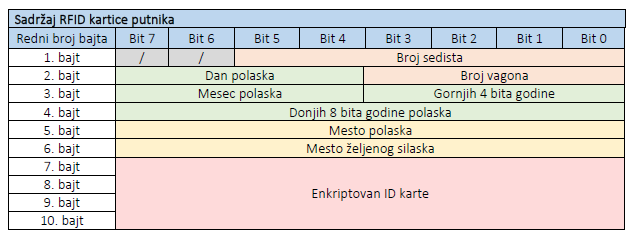

#####  Validacija kartice* 

Na početku putovanja i kad voz dostigne na peron stanice kontrola iz stanice prosledi podatke kartice novih putnika centralnoj kontroli voza. Centralna kontrola voza podatke kartica novih putnika prosleđuje preko UART-a glavnoj kontroli vagona vagonu kojem je putnik dodeljen. Ovo postiže instrukcijom koja inicijalizuje jedno ili više zauzetih mesta. 

Podatake GKV smešta u memoriju na pozicije koja odgovaraju sedištu novih putnika i prosleđuje ih odgovarajućim kontrolerima sedišta. U posebnim slučajevima da se prosleđuju admin ili gost identifikacija, onda se oni upisuju u svaki kontroler sedišta. 

Putnik kad ulazi u voz mora prvo da učita svoj RFID karticu na RFID čitač koji se nalazi na ulazu  vagona.  RFID  čitač  pročitane  podatke  prosleđuje  preko  SPI  GKV-u  koji  upoređuje  sa podacima putnika koje ima u memoriji. U slučaju da je kartica validna ulaz se otvara, u suprotnom putnik ne može ući u voz, i treba zatražiti podršku od osoblja. Putniku je dodeljeno 10 sekundi za ulazak, u slučaju da ne stigne da uđe vrata se zatvaraju. Vreme je ispisano na sedmosegmentnom displeju. 

Putnik nakon ulaska u voz bi trebao da se smesti u svoje sedište. Na svakom sedištu se nalazi kontroler sedišta koji je povezan sa RFID čitačem unutar sedišta. Ponovo se putnikova kartica čita pomoću čitača i upoređuje sa memorijom iz KS-a. U slučaju da je kartica validna, pali se žuta led dioda da je kartica u blizini. Ako se mesto zauzme onda se pali zelena, ako posle 10 sekundi putnik ne sedne onda se ugasi žuta dioda. 

#### Regulisanje unutrašnjosti vagona 

Kontrolisanje uređaja za temperaturu, osvetljenje i pokretanje prozora zadužen je GKV tog vagona. Same vrednosti i parametri na koje ti uređaji mogu biti podešeni kontroliše CKV, koji slanjem vrednosti GKV-u zabranjuje odstupanje od poslatih vrednosti. Upis ovih vrednosti se postiže instrukcijama namenjenim za podešavanje tih parametara. Reagovanje na promene ovih parametara  je  zadužen  GKV  koji  nakon  primljene  instrukcije  započinje  odgovarajuće potprograme. 

U slučaju detekciju dima ili pritisnutog panik tastera, GKV ima potprograme sa kojim reaguje odgovarajuće na detekciju. Takođe GKV obaveštava CKV o detekciji ovih pojava, nakon čega CKV reaguje slanjem komande drugim GKV-ovima da reaguju na trenutnu situaciju. U slučaju detekcije dima, prozori se spuštaju i otvaraju se sva vrata vagona. 

U slučaju instrukcije da se ispišu brojevi sedišta putnika koji treba da siđu od strane CKV- a GKV-u, GKV reaguje ispisivanjem svih brojeve sedišta svih putnika koji treba da siđu na trenutnoj stanici, tako što na svakih 10 sekundi ciklično ispisuje brojeve sedišta. Ako nakon određenog vremena putnik ne siđe, GKV šalje informaciju CKV-u o tome da neko od putnika nije sišao. Nakon ovoga, CKV šalje instrukciju GKV-u da pošalje brojeve sedišta i vagona putnika koji nisu sišli. Dalje postupanje po prijemu ovih informacija nije određeno. 

#### Regulisanje sedišta u vagonu 

Pri prijemu informacije o novom putniku, podaci njegove kartice se prosleđuju od CKV do KS koje se nalazi u sedištu koje je putniku dodeljeno. Svako KS očekuje odgovarajućeg putnika koje mu je dodeljeno. KS poseduje podatke o najviše tri moguće kombinacije podataka na kartici koje smatra da su validne. Podaci sa putnikove, adminove ili gost kartice. 

Putnik nakon ulaska u voz bi trebao da se smesti u svoje sedište. Na svakom sedištu se nalazi kontroler sedišta koji je povezan sa RFID čitačem unutar sedišta. Putnikova kartica se čita pomoću čitača i upoređuje se sa memorijom iz KS-a. U slučaju da je kartica validna, pali se žuta led dioda koja indikuje da je kartica u blizini. Ako se mesto zauzme onda se pali zelena led dioda, ako ne, u roku od 10 sekundi, onda se žuta led dioda ugasi. Kontrola led dioda se postiže pomoću KS-a, koji poseduje podatak o kartici koja je u blizini. Detekcija da li je putnik zauzeo mesto je postignuta pomoću senzora na sedištu, koji je povezan sa KS-om. 

Kraj sedišta se nalazi panik taster, koji je povezan sa KS-om. Panik taster služi putniku da obavesti osoblje da mu je pozlilo. Ovu informaciju KS prosleđuje GKV-u, koji dalje prosleđuje CKV- u. Ovim načinom je osoblje obavešteno da je putniku pozlilo i da mu je potrebno pružiti pomoć. Mesto i tip tastera se bira tako da ga je teže slučajno pritisnuti čime bi se izbegle lažne uzbune. Debaunsiranje tastera je odrađeno softverski. 

Kraj sedišta se nalazi i prekidač za otvaranje i zatvarnaje prozora. Koje ako je dozvoljena kontrola, moguće je da putnik otvori-zatvori odgovarajući prozor. Jedan prozor je dodeljen dvojici putnika. Prednost ima onaj koji želi da zatvori prozor. 

Iznad sedišta nalazi se noćno svetlo, plave boje. Ovo svetlo može putnik da upali pomoću tastera ako to KS dozvoljava. U slučaju detektovanja dima automatski se pale sva noćna svetla. 

Iznad sedišta se takođe nalazi ventilacija za klimu koja ima pokretni poklopac kojoj je dodeljen taster. Poklopac može da se automatski zatvori ili otvori ako KS to dozvoljava. 

### ORGANIZACIJA GLAVNOG KONTROLERA VAGONA

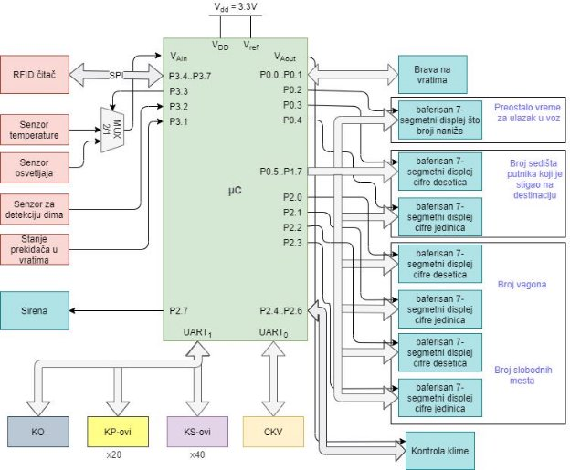

Slika 3.2.1 – *Blok šema glavnih komponenti povezanih na GKV* 

####  Povezan hardver 

Senzor temperature  

Za merenje temperature u vagonu nije potrebna velika rezolucija i preciznost, zbog čega je moguće iskoristiti jednostavniji i jeftiniji senzor. Korišćen senzor temperature je baziran na zavisnosti otpornosti termistora od temperature u vagonu. Napon na termistoru je povezan na ulaz AD konvertora mikrokontrolera (GVK-a). Vrednosti otpornika se biraju zavisno od toga koje opsege očekujemo, tj. Gde se nalaze stanice voza i dizajna vagona. 

Slika 3.2.1.1 – *Električna šema senzora temperature* 

Senzor osvetljaja 

Za merenje osvetljaja u vagonu nije potrebna velika rezolucija i preciznost, zbog čega je moguće iskoristiti jednostavniji i jeftiniji senzor. Korišćen senzor osvetljaja je baziran na zavisnosti otpornosti fotootpornika od osvetljaja na njemu. Napon na otporniku je povezan na ulaz AD konvertora mikrokontrolera (GVK-a). Vrednosti otpornika se biraju zavisno od toga koje opsege očekujemo, tj. Gde se nalaze stanice voza i dizajna vagona. 

Slika 3.2.1.2 – *Električna šema senzora osvetljaja* 

Detektor dima i sirena 

Za  detektovanje  dima unutar  vagona iskorišćen  je detektor  zapaljivih  gasova  MQ-2  i dodatan hardver za njegovo pravilno korišćenje. Na detektoru postoji zelena led dioda koja ukazuje da je detektor uključen i crvena koja ukazuje da li je detektovan dim. Osetljivost uređaja je moguće podesiti pomoću potenciometra na ulazu operacionog pojačavača. Izlaz pojačavača ukazuje da li je detektovan dim, i na tom delu su povezane žice koje vode direktno do sirene (radi bržeg  reagovanja)  i  na  ulaz  mikrokontrolera  (GVK-a).  Pin  za  mikrokontroler  je  povezan  na potenciometar da ne bi oštetili ulaz mikrokontrolera, jer on očekuje 3.3V.*** 

Slika 3.2.1.3 – *Električna šema detektora dima* 

Slika 3.2.1.4 – *Električna šema sirene za alarm* 

Displejevi 

Displej na kome se ispisuju sedišta putnika koji treba da siđu na trenutnoj stanici se sastoji od dva sedmosegmentna displeja sa baferisanim ulazima.  Takođe i displejevi van vagona su povezani na isti način. 

Svi  ulazi  bafera  za  displejeve  su  povezani  na  iste  pinove  mikrokontrolera  i  pomoću selekcionih signala moguće je upisivati pojedinačne.*** 

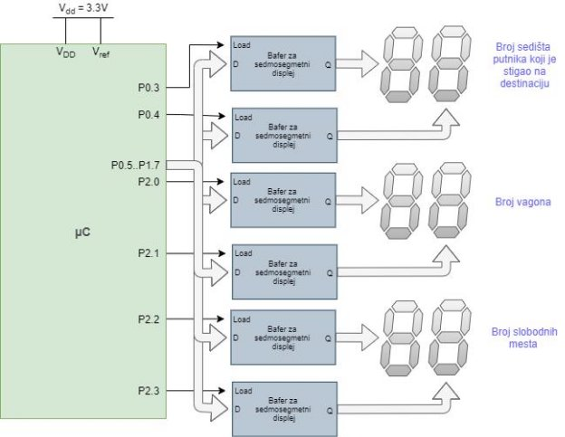

Slika 3.2.1.5 – *Električna šema displeja za putnike* 

Hardver na ulaznim vratima 

Vrata  vagona  se  otključavaju  pomoću  elektromehaničke  brave,  koja  je  kontrolisana signalima  za  otvaranje i  zatvaranje  i  .  Logička  jedinica na  odgovarajućem  pinu uključuje odgovarajući  relej  i  obezbeđuje  traženu  pobudu.  Mikrokontroler  ovu  pobudu  drži  aktivnu određen  period  korišćenjem  *free-running*  brojača.  Elektromehanička  brava  zahteva  da  ova pobuda bude aktivna između 100ms i 200ms. U slučaju detektovanja dima ulazna vrata vagona koji je detektovao drži duže ovaj signal. Ovi signali se koriste i za kontrolisanje rada led diode koja ukazuje da je dozvoljen ulaz putniku. 

Maksimalno trajanje ulaska je programirano na 10 sekundi, što je određeno zadatim specifikacijama. Ovaj vremenski period počinje da se odbrojava mikrokontroler i ispisuje na sedmosegmentni displej, koji je povezan na sličan način kao i displej za silazak putnika. Korišćen je samo jedan sedmosegmentni displej za prikaz 10 sekundi. 

Na bravima vrata se nalazi senzor koji registruje da li su vrata otvorena ili zatvorena. Ovo se postiže prostim kontaktnim prekdačem, *reed switch* senzorom.  

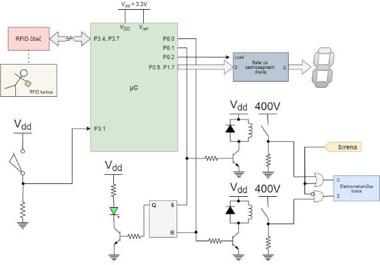

Slika 3.2.1.5 – *Električna šema automatizovanih ulaznih vrata* 

Kontrola klime 

Dizajn  vagona  je  takav  da  svaki  vagon  poseduje  po  jedan  klima  uređaj  čije hlađenje/grejanje je dovedeno do svakog sedišta. Putnik pomeranjem prekidača podešava da li će se otvoriti ili zatvoriti ventil dotoka vazduha iz klime iznad njegovog sedišta. Da li su prozori otvoreni prati GKV dok komunicira sa KP preko UARTA. U slučaju da KP javi da je prozor otvoren, klima se gasi.

Slika 3.2.1.6 – *Električna šema povezivanje klime uređaja* 

Kontroler osvetljenja 

Kontroler osvetljenja kontroliše stanje tri glavne sijalice u vagonu, koje ili kontroliše da rade ili da ne rade. Njihovo paljenje takođe može da spreče prekidači unutar vagona. U slučaju detektovanja dima upaliće se sva noćna svetla odmah, neće ići preko mikrokontrolera, dok glavna svetla će mikrokontroler da upali programski. Kontroler povremeno proverava da li se neka od sijalica pokvarila.

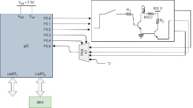

Slika 3.2.1.7 – *Električna šema povezivanje kontrolera osvetljenja* 

Kontroler prozora 

Kontroler prozora kontroliše rad prozora i prati u kom su stanju. Pomoću kontaktnih prekidača  unutar  prozora  kontroler  ima  uvid  da  li  su  prozori  otvoreni,  otvoreni  do  kraja  ili zatvoreni.  Prekidači  za  otvaranje-zatvaranje  prozora  se  nalaze  unutar  vagona  za  korišćenje putnika. Osim ovih prekidača postoje i tasteri kod sedišta putnika. Ali u slučaju da je zabranjeno otvaranje,  prekidači  i  tasteri  nemaju  uticaj  na  kontrolu  prozora.  Prozore  je  takođe  moguće otvoriti pomoću instrukcije poslate od strane GKV-a, tj. od CKV-a.*** 

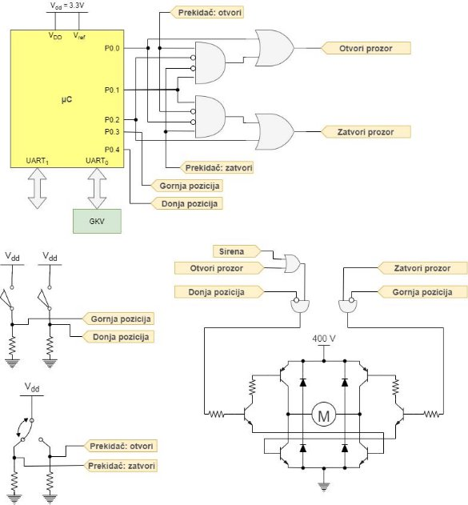

Slika 3.2.1.8 – *Električna šema povezivanje kontrolera prozora* 

### ORGANIZACIJA KONTROLERA SEDIŠTA

Slika 3.3.1 – *Blok šema glavnih komponenti povezanih na KS* 

####  Povezan hardver 

Kontrola prisutnosti putnika i panik taster 

Kontrola prisutnosti putnika prati da li je putnik u blizini i da li je seo na mesto. Za detekcija prisustva u  svom  sedištu  moguće  je  koristiti  senzor  F-1676  od  *FSRTEK*  čime  bi  imali tačniju detekciju. Paljenje i gašenje dioda kontroliše KS pomoću free running brojača i to se rešava programski.Debaunsiranje panik tastera je takođe urađeno softverski. 

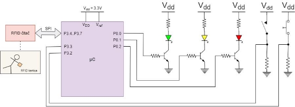

Slika 3.3.1.1 – *Električna šema hardvera koja zaslužna za stanje putnika u sedištu* 

Noćno svetlo 

Noćno svetlo iznad sedišta ima karakterističnu plavu boju nižeg intenziteta. Ovo svetlo se automatski pali ako se detektuje dim, nezavisno od nivoa osvetljenja u vagonu. Taster za paljenje ovog svetla se nalazi kraj sedišta, i moguće je da ga GKV zabrani njegov uticaj na paljenje svetla. Debaunsiranje je odrađeno softverski. 

Slika 3.3.1.2 – *Električna šema hardvera noćnog svetla* 

Dotok klime, ventilacija 

Dotokom  klime  se  smatra  poklopac  iznad  putnika  koji  može  da  se  zatvori  ili  otvori korišćenjem tastera za to. Ovu kontrolu GKV može da zabrani i dozvoli. Moguća optimizacija je dodavanje ventilatora unutar tog dovoda koji može da takođe i uvlači vazduh čime bi se u slučaju požara pomoglo pri odvođenju štetnog gasa. Ova optimizacija bi morala da prođe sigurnosno testiranje. 

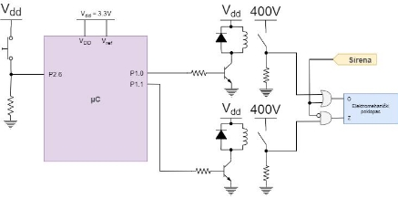

Slika 3.3.1.3 – *Električna šema hardvera dotoka klime* 

##  LITERATURA

- Namenski računarski sistemi, L. Saranovac, I. Popović 
- Sajt predmeta: http://tnt.etf.rs/~oe4nrs
- Detektor dima: https://www.electronicshub.org/smoke-detector-circuit 
- MQ-2 :[ https://www.pololu.com/file/0J309/MQ2.pdf](https://www.pololu.com/file/0J309/MQ2.pdf) 
42 
